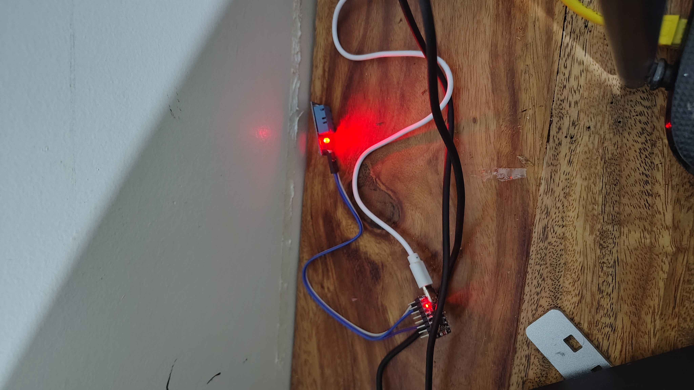
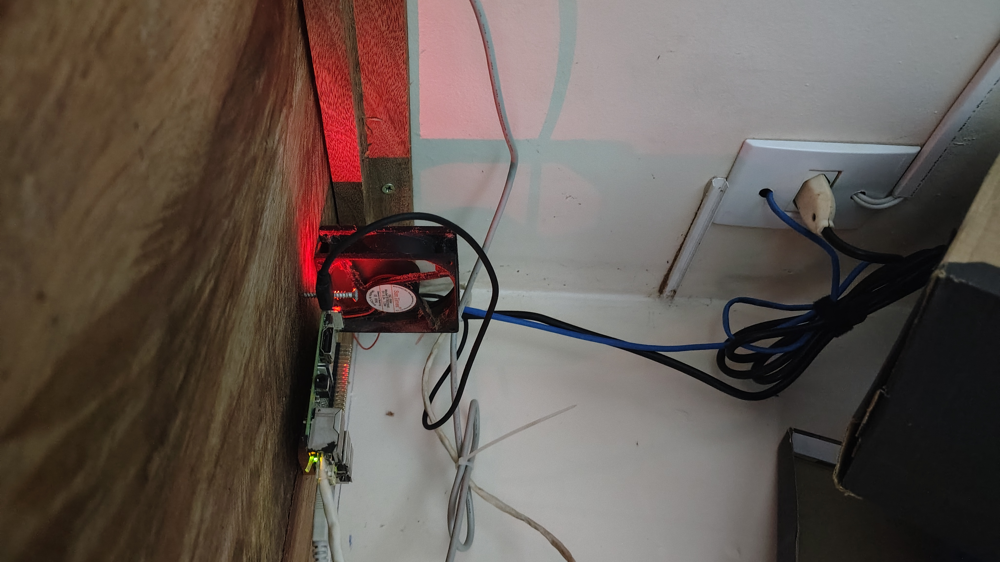
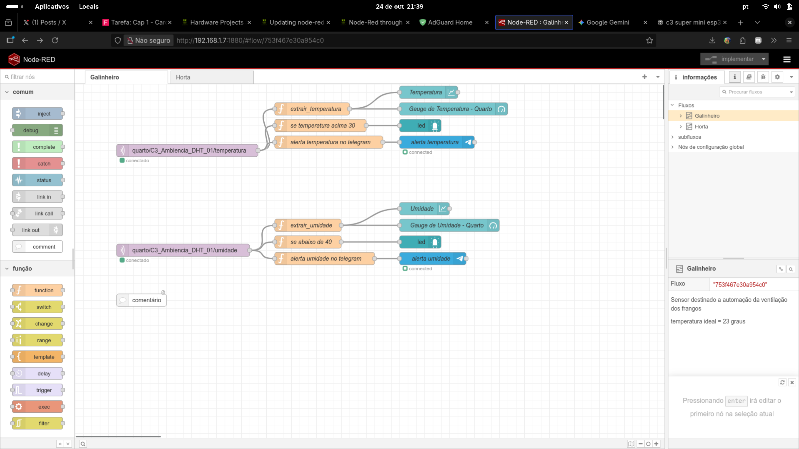
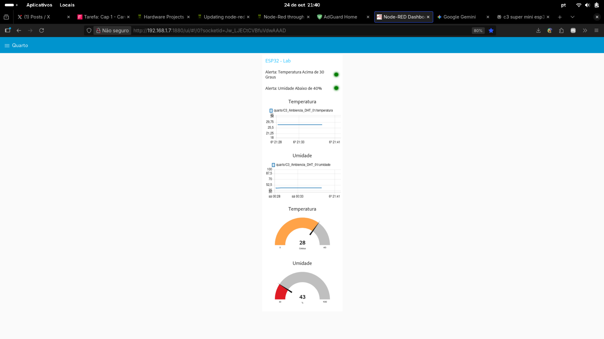

# Relatório da Atividade da Fase 3, Cap 1: CardioIA Conectada

## Introdução

Este relatório detalha a implementação da atividade "CardioIA Conectada: IoT e Visualização de Dados para a Saúde Digital", correspondente ao Capítulo 1 da Fase 3 do projeto. O objetivo principal foi desenvolver um protótipo de sistema de monitoramento contínuo de sinais vitais, abrangendo desde a captura de dados em um dispositivo de ponta (Edge) até a sua visualização e processamento em uma plataforma centralizada.

É importante destacar que, ao contrário da sugestão de utilizar o simulador Wokwi, **o projeto foi implementado com hardware real**, proporcionando uma experiência mais prática e alinhada com os desafios de mercado. A solução utiliza um microcontrolador ESP32 C3 SuperMini, um sensor de temperatura e umidade DHT22, e um Raspberry Pi 3B para rodar o broker MQTT e o Node-RED.

## Arquitetura da Solução

O sistema foi estruturado em três camadas principais:

1.  **Edge (Captura de Dados):** Um microcontrolador **ESP32 C3 SuperMini** conectado a um sensor **DHT22** é responsável por coletar dados de temperatura e umidade do ambiente. O código embarcado foi desenvolvido em C++ no ambiente Arduino.
2.  **Comunicação (MQTT):** Os dados coletados são transmitidos via Wi-Fi para um broker MQTT, que está rodando em um **Raspberry Pi 3B** na rede local. O protocolo MQTT foi escolhido por sua leveza e eficiência, ideal para aplicações IoT.
3.  **Fog/Cloud (Processamento e Visualização):** O **Node-RED**, também em execução no Raspberry Pi, assina os tópicos MQTT para receber os dados em tempo real. Ele processa essas informações, exibe em um dashboard interativo e envia alertas automáticos.

### Hardwares Utilizados

Abaixo estão as imagens dos componentes físicos que compõem a solução.

**Homelab com os componentes integrados:**

**Raspberry Pi 3B (Servidor MQTT e Node-RED):**

**ESP32 C3 SuperMini (Dispositivo de Captura):**

## Parte 1: Armazenamento e Processamento Local (Edge)

Nesta etapa, o foco foi o desenvolvimento do dispositivo de captura.

*   **Hardware:** Foi utilizado o ESP32 C3 SuperMini e o sensor DHT22, que mede tanto temperatura quanto umidade.
*   **Código (`sketch_dht22_Cardio.ino`):** O sketch em C++ (`sketch_dht22_Cardio.ino`) implementa a conexão Wi-Fi, a leitura periódica do sensor e a publicação dos dados via MQTT.
*   **Resiliência:** A resiliência do sistema é garantida pelo código que gerencia a reconexão automática tanto com a rede Wi-Fi quanto com o broker MQTT em caso de falha de comunicação, assegurando que o sistema volte a operar e transmitir dados assim que a conexão for restabelecida.

## Parte 2: Transmissão e Visualização (Fog/Cloud)

A segunda parte concentrou-se em receber, processar e visualizar os dados.

*   **Fluxo Node-RED (`flows_node_red.json`):** O arquivo `flows_node_red.json` contém todo o fluxo de trabalho. Ele é configurado para:
    1.  Receber os dados de temperatura e umidade dos tópicos MQTT.
    2.  Processar e formatar os valores para exibição.
    3.  Alimentar os componentes do dashboard.
    4.  Verificar se os valores ultrapassam limites pré-definidos para gerar alertas.
    5.  Enviar notificações para um bot do Telegram em caso de alerta, uma funcionalidade adicional que enriquece o projeto.

*   **Dashboard e Fluxo de Dados:** As imagens abaixo mostram o fluxo de dados no Node-RED e o dashboard interativo resultante.

**Fluxo de Dados no Node-RED:**

**Dashboard Interativo no Node-RED:**
O dashboard exibe em tempo real a temperatura e a umidade através de gráficos de linha e medidores (gauges), além de LEDs que indicam o estado de alerta.

## Conclusão

A atividade foi concluída com sucesso, atingindo todos os objetivos propostos no enunciado. A decisão de utilizar hardware real permitiu ir "além" do escopo básico, enfrentando desafios práticos de conectividade e integração de dispositivos. O resultado é um protótipo funcional e robusto que demonstra de forma eficaz o ciclo completo de um sistema de monitoramento de saúde baseado em IoT, desde a captura dos dados na ponta até a sua visualização e geração de alertas em uma plataforma centralizada.
